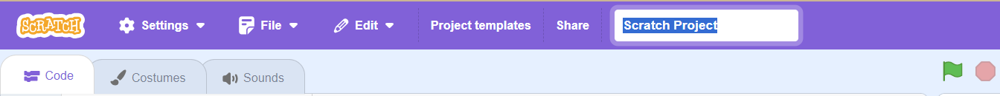
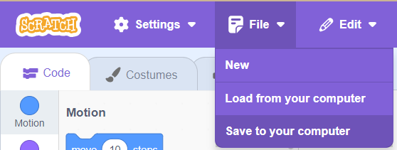
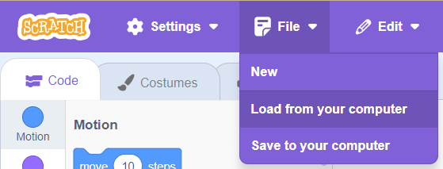

## Make: Prototype, Test, Iterate

Let's dive into the next steps of making your idea come to life!

1. **Prototype**: Think of this as a mini-version or a "draft" of your idea. It's like when you draw a rough sketch before making a big painting. You'll be making a simple version of your project – don't worry about making it perfect! It's just so you can see how it might work in real life. You'll make an ML model, just like you did before, then link it to an awesome Scratch project your users can interact with.

2. **Test**: This is the fun part! 🚀 Try out your prototype to see how it works. It's like playing a new game for the first time to find out if it's fun or if there are any glitches. Ask your friends or family to try it too; they might have some cool ideas or notice things you missed! Get feedback from your users about their experience - try the '2 ⭐s and a wish' method!

3. **Iterate**: "Iterate" is just a fancy word that means "do it again, but better." Based on what you learned from testing, go back and make some changes to your prototype. Maybe you want to add something new or fix a part that didn't work right.

Remember, it's all about trying, learning, and improving. Every time you go through these steps, your idea will get better and cooler! 

Ready to give it a go? Great!

### Gather data
Before you can train your Machine Learning model, you need to pick a dataset for your project. Think of it as choosing the right set of LEGO bricks to build an epic creation!

--- collapse ---
---
title: Choose a dataset
---

**What's a dataset?**
It's like a big collection of information that your machine will learn from. For example, it could be a list of songs, pictures of animals, or even recordings of different sounds!

**Where can you find datasets?**
1. There are some cool websites that offer open-source datasets for free! Websites like [Kaggle](https://www.kaggle.com/datasets) or [UCI Machine Learning Repository](https://archive.ics.uci.edu/ml/index.php) have loads of them. Just like when you search online for your favorite game cheats or tips, search for the topic you're interested in!
2. Remember in the previous stage of the challenge where you made your own dataset on Machine Learning 4 Kids? Guess what? You can do that again! Gather your own photos, texts, or sounds and build your unique dataset.

**A few things to keep in mind:**
- **Safety First!**: 🛡️ When browsing online, be careful! Some datasets might not be suitable for kids. Always ask an adult or your teacher if you're unsure about using a certain dataset.
- **Clean and Tidy**: 🧹 Some datasets can be like messy bedrooms. They might have missing pieces or errors. So, always check your dataset and make sure it's neat and clean before using it.
- **Size Matters**: 📈 Imagine trying to become a Pokémon master with only two Pokémon cards...it's tough, right? In the ML world, the more training data (like pictures or sounds) you have, the better your model can become! It's like having a fuller deck of cards to play with. So, while you don't need billions of pieces of data for your model like ChatGPT, having a good-sized dataset can make your model smarter and more accurate.

Time to gather your data tools and set forth on this quest!

--- /collapse ---

[[[make-a-model-ml4k]]]
[[[add-training-data-ml4k]]]

### Train the model
Imagine teaching your pet dog a trick. You show it what to do, reward it when it does right, and correct it if it makes a mistake. Over time, it learns and gets better. Similarly, with machine learning, you're kind of "teaching" your computer a trick using your dataset.

--- collapse ---
---
title: Train the model
---

**What's the Trick?**  
You'll be showing your computer tons of examples from your chosen or created dataset. For instance, if you have a collection of pictures of Pokémon, you'll tell the computer which ones are Pikachu and which ones aren't.

**Practise Makes Perfect:**  
The computer will then go through each one, learning and making guesses. Sometimes it'll get it right, and other times it might mess up. But the more examples you show, the better it'll get at guessing correctly.

**Testing Time!**  
After teaching (or training!) your model with lots of examples, you can then show it a new picture and see if it can correctly guess if it's a Pikachu or not. It's like a mini quiz for your computer!

**More Data, Smarter Model:**  
Just like reading more books makes you super smart, the more examples (data) you give to your model, the smarter it gets!

So, grab your chosen or created dataset, and let's start training! Think of yourself as a computer coach, helping your computer learn and grow.

--- /collapse ---

--- collapse ---
---
title: Testing with Audio
---

--- /collapse ---

--- collapse ---
---
title: Testing with Text
---

--- /collapse ---

### Build in Scratch
Combine the magic of Scratch with the smarts of your trained machine learning model! Turn your smart new computer brain into a game, a helper tool, or even a fun quiz! You've trained your model, tested its skills, and now it's showtime! Dive into Scratch, let your creativity run wild, and build something truly amazing.

--- collapse ---
---
title: Pro tip - Save your work!
---

This special version of Scratch allows you to access your machine learning model, as well as use the music database blocks - **if you try to open your project in another version of Scratch online it probably won’t work**. 

A hack you can use is to save your work to your computer often:

--- task ---

First, give your program a name by typing the name of your program in the project name box at the top of the screen:

--- /task ---

--- task ---

To save your project, click on **File**, and then on **Save to your computer**:

Your Scratch `.sb3`  file will be saved to your computer. 

--- /task ---

Once you have the .sb3 file for your project saved you can open it again later, or on another computer:
+ Go to [rpf.io/mlscratch](rpf.io/mlscratch){:target="_blank"} to get to this special fork of Scratch 
+ Once Scratch opens choose File > Load from your Computer
+ Select your file in the window that appears to get back to where you left off

Save your work as often as you can to make sure you don’t lose any progress!

--- /collapse ---

[[[generic-scratch-backdrop-from-library]]]
[[[generic-scratch3-paint-new-backdrop]]]

[[[generic-scratch-sound-from-library]]]
[[[scratch3-record-sound]]]

[[[generic-scratch3-sprite-from-library]]]
[[[generic-scratch3-add-sprite-from-file]]]
[[[generic-scratch3-draw-sprite]]]
[[[generic-scratch3-add-costume]]]
[[[scratch3-left-right-direction]]]

[[[generic-scratch3-broadcast-message]]]
[[[scratch3-ask-answer-chat]]]
[[[scratch3-copy-code]]]
[[[scratch3-join-text]]]
[[[generic-scratch3-add-variable]]]
[[[generic-scratch3-make-list]]]

### Test and Iterate
You've designed an exciting Scratch application powered by machine learning. Now it's time to share it and gather some feedback to make it even better! Here's why feedback matters: think of it as someone telling you which parts of a puzzle look amazing and which pieces might fit better elsewhere.

**1. Two Stars and a Wish 🌟🌟💫:**  
This method is like getting mini-reviews!
- 🌟 **First Star:** What was super cool about your project.
- 🌟 **Second Star:** Another awesome part they enjoyed.
- 💫 **A Wish:** A friendly tip or idea for improvement.

**2. The Stoplight System 🚦:**  
Present your project and then hand out three colored cards: Red, Yellow, and Green.
- 🟢 Green Card: Parts of your project that are good to go!
- 🟡 Yellow Card: Areas that might need a little bit of tweaking.
- 🔴 Red Card: Things that need a second look.

**3. Picture Storyboard 🖼️:**  
Give them a few blank paper panels and ask them to draw:
- Their favorite part of your application.
- A scene or part where they were a bit confused.
- Any new idea or feature they imagine would be great!

After collecting feedback, hop back into Scratch and fine-tune your project. Adjustments based on what others think can turn your great project into an amazing one! Remember, every piece of advice is a step towards perfection. Keep iterating and have fun! 🚀🎨