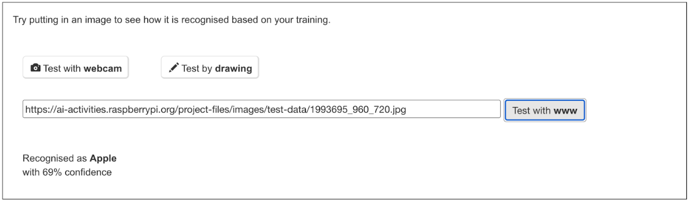
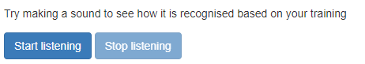
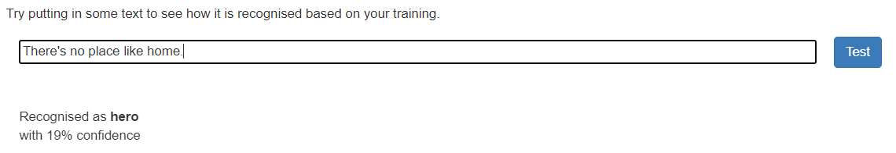

## Make: Prototype, test, iterate

Let's look at the next steps of making your idea come to life!

1. **Prototype**: Think of this as a mini-version or a "draft" of your idea. It's like when you draw a rough sketch before making a big painting. You'll make a simple version of your project — don't worry about making it perfect! It's just so you can see how it might work in real life. You'll make an ML model, just like you did before, then link it to an awesome Scratch project your users can interact with.

2. **Test**: This is the fun part! 🚀 Try out your prototype to see how it works. Ask your friends or family to try it too; they might have some cool ideas or notice things you missed! Get feedback from your users about their experience — try one of the example feedback methods at the bottom of this page!

3. **Iterate**: "Iterate" just means "repeat the process, with the aim of making it better". Based on what you learnt when you and others tested your app, go back and make some changes to your prototype. Maybe you want to add something new or fix a part that didn't work right.

Remember, it's all about trying, learning, and improving. Every time you go through these steps, your idea will get better and cooler! 

Ready to give it a go? Great!

### Gather data
Before you can train your machine learning model, you need to pick a data set for your project. 

--- collapse ---
---
title: Choose a data set
---

**What is a data set?**
A data set is a big collection of information that you can use to train your machine learning model. For example, it could be a list of songs, pictures of animals, or even recordings of different sounds!

**Where can you find data sets?**
1. There are some cool websites that offer open-source data sets for free! Websites like [Kaggle](https://www.kaggle.com/datasets) or [UCI Machine Learning Repository](https://archive.ics.uci.edu/ml/index.php) have loads of them. You can search these sites for the topic you're interested in.
2. Remember in the previous stage of the challenge where you made your own data set on Machine Learning for Kids? Guess what? You can do that again! Gather your own photos, texts, or sounds and build your unique data set.

**A few things to keep in mind:**
- **Safety first!**: 🛡️ When browsing online, be careful! Some data sets might not be suitable for kids. Always ask an adult or your teacher if you're unsure about using a certain data set.
- **Clean and tidy**: 🧹 Some data sets can be like messy rooms. The data set might have missing pieces or errors. So, always check your data set and make sure it's neat and clean before using it.
- **Size matters**: 📈 Imagine trying to speak a whole new language after only having one lesson...it's tough, right? In the machine learning world, the more training data (like pictures or sounds) you have, the better your model can become! So, while you don't need billions of pieces of data for your model, having a good-sized data set can make your model more accurate.

Time to gather your data tools and start making!

--- /collapse ---

[[[make-a-model-ml4k]]]
[[[add-training-data-ml4k]]]

### Train the model
Training an ML model is just teaching a computer by showing it many labelled examples. The more examples you give it, the better it becomes at identifying patterns and using those patterns in the task you've set it, such as telling cats from dogs, for example.

--- collapse ---
---
title: Train the model
---

**What's the trick?**  
You'll be providing your computer with tons of examples from your chosen or created data set. For instance, if you have a collection of pictures of Pokémon, you'll tell the computer which ones are Pikachu and which ones aren't.

**Practice makes perfect:**  
The computer will then process each picture, assess it for patterns, and make a prediction of what the picture contains. Sometimes it'll get the prediction right, and other times it might mess up. But the more labelled examples you give it, the better it'll get at correctly predicting what's a new image.

**Testing time!**  
After training your model with lots of examples, you can then input a new picture and see if it can correctly predict if it's a Pikachu or not. It's like a mini quiz for your computer!

**More data, smarter model:**  
Just like reading more books makes you super smart, the more examples of labelled data you give to your model, the more reliable it gets!

So, grab your chosen or created data set, and let's start training! Think of yourself as a computer coach, helping your model improve by providing lots of practice and training.

--- /collapse ---

--- collapse ---
---
title: Testing with images
---

Drag and drop an image into the link box (next to the Test with www button):

Alternatively, you can:

+ Right-click on an image
+ Select **Copy image address**
+ Paste the image address into the link box

Then, click the **Test with www** button to test your model.

--- /collapse ---

--- collapse ---
---
title: Test with audio
---

Click the **Start listening** button to test your machine learning model.

Input one of the sounds that you have trained the computer to classify. When your machine learning model processes the sound, it will show a prediction of what it is.

If you’re not happy with how the model is working, go back to the **Train** page (by clicking **Back to project** and then **Train**) and add more examples to all the training buckets. For example, try varying your speed and pronunciation, get other people to add samples in their voice...or do some funny voices yourself!

--- /collapse ---

--- collapse ---
---
title: Test with text
---

**Text projects need to be retrained after 24 hours:** If you are working on a text-based model, you will need to click the button to train your model if you have left it overnight. Your training data will be kept online, but the model will time out after 24 hours. The model will need to be retrained at the start of each session; this should only take a few minutes each time.

To see how successful your model is at classifying your text, test your model by pasting or typing a sample into the field that appears.

**IMPORTANT:** Make sure you don't use text that already exists in your training data!

Click the **Test** button to test your model. Your model will provide a prediction based on the text you entered and will tell you the level of confidence the model has in that prediction.

--- /collapse ---

### Build in Scratch
Combine the magic of Scratch with the digital smarts of your trained machine learning model! Turn your cool new model into a game, a helper tool, or even a fun quiz! You've trained your model, tested its accuracy, and now it's showtime! Dive into Scratch, let your creativity run wild, and build something truly amazing.

--- collapse ---
---
title: Pro tip: Save your work!
---

This special version of Scratch allows you to access your machine learning model, as well as use the music database blocks. **But: if you try to open your project in another version of Scratch online, it won’t work.** 

A solution you can use is to save your work to your computer often:

--- task ---

First, give your program a name. Type the name of your program in the project name box at the top of the screen:

--- /task ---

--- task ---

To save your project, click on **File**, and then on **Save to your computer**:

Your Scratch `.sb3` file will be saved to your computer. 

--- /task ---

Once you have the .sb3 file for your project saved, you can open it again later, or on another computer:
+ Go to [rpf.io/mlscratch](rpf.io/mlscratch){:target="_blank"} to get to this special fork of Scratch 
+ Once Scratch opens choose **File** > **Load from your computer**
+ Select your file in the window that appears to get back to where you left off

Save your work as often as you can to make sure you don’t lose any progress!

--- /collapse ---

[[[generic-scratch-backdrop-from-library]]]
[[[generic-scratch3-paint-new-backdrop]]]

[[[generic-scratch-sound-from-library]]]
[[[scratch3-record-sound]]]

[[[generic-scratch3-sprite-from-library]]]
[[[generic-scratch3-add-sprite-from-file]]]
[[[generic-scratch3-draw-sprite]]]
[[[generic-scratch3-add-costume]]]
[[[scratch3-left-right-direction]]]

[[[generic-scratch3-broadcast-message]]]
[[[scratch3-ask-answer-chat]]]
[[[scratch3-copy-code]]]
[[[scratch3-join-text]]]
[[[generic-scratch3-add-variable]]]
[[[generic-scratch3-make-list]]]

### Test and iterate
You've designed an exciting Scratch application powered by a machine learning model. Now it's time to share it and gather some feedback to make it even better! Here's why feedback matters: think of it as someone telling you which parts of a puzzle look amazing and which pieces might fit better elsewhere.

**1. Two stars and a wish 🌟🌟💫:**  
This method is like getting mini-reviews! Ask your users for two good things and something to improve: 
- 🌟 **First star:** What was super cool about your project?
- 🌟 **Second star:** Another awesome part they enjoyed
- 💫 **A wish:** A friendly tip or idea for improvement

**2. The stoplight system 🚦:**  
Present your project and then hand out three coloured cards: Red, yellow, and green.
- 🟢 Green card: Parts of your project that are good to go!
- 🟡 Yellow card: Areas that might need a little bit of tweaking
- 🔴 Red card: Things that need a second look

**3. Picture storyboard 🖼️:**  
Give your testers a few blank paper panels and ask them to draw:
- Their favourite part of your application
- A scene or part where they were a bit confused
- Any new idea or feature they imagine would be great!

After collecting your feedback, hop back into Scratch and fine-tune your project. Adjustments based on what others think can turn your great project into an amazing one! Remember, every piece of advice is a step towards perfection. Keep iterating and have fun! 🚀🎨
