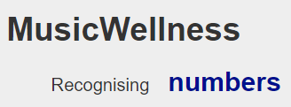
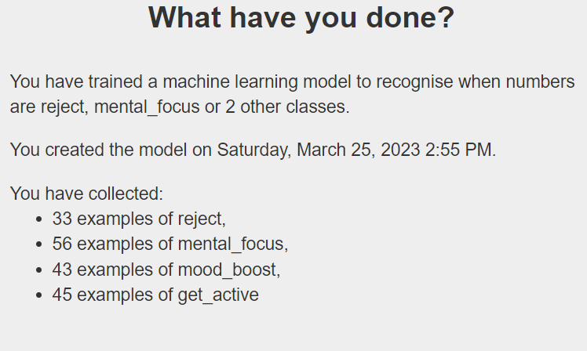

## Wrap-Up: Finalise and Reflect

Alright, tech superstars! 🌟

The finish line is just around the corner! You've worked hard, innovated, and crafted your AI app. Now, it's time to put on those final touches and take a moment to reflect on the fantastic journey.

You've journeyed through brainstorming ideas, creating models, crafting applications, and gathering feedback. Now, it's time for two very crucial steps: **Finalize & Reflect**. This is the last thing to do before filling out your entry form and sharing your work with the world!

---

🛠️ **Finalize:**  
This is your chance to perfect your creation. Think of this as adding the cherry on top of an ice cream sundae. Make sure all the parts of your app work smoothly and look dazzling. Remember, all great inventors take a moment to review and make sure their invention is in top shape.

**Reflect 🤔:**  
Once done, take a step back. Think about your journey. What was the most exciting part? Were there any challenges? What did you learn from them? Reflection isn't just about looking back, it's about understanding the path you took and how it has helped you grow. We've got some questions for you to reflect on, the answers to which make up part of your Experience AI Challenge entry.

🚀 **Submission Time:**  
Once you're ready, and you feel your AI app is the best version of your ideas, it's time to share it with the world! We at **Raspberry Pi** and **Google Deepmind** can't wait to see what you've built. By sending it to us, you're not just sharing an app; you're showcasing your creativity, dedication, and innovative spirit.

---

So go ahead, finalize that masterpiece, and take a moment to pat yourself on the back. You've embarked on a tech voyage, and we're thrilled to have been part of it. We can't wait to see where your imagination has taken you! Get ready to shine, and know that you're making the tech world a brighter place! 🚀🎉🥳

### You will:
+ Create a **Model Card** for your machine learning model
+ Complete the **submission form** and upload your **scratch application**
+ Complete the **participant survey**

Once you submit your entry, your work will be looked at by a panel of AI experts and educators. You’ll get feedback on your work, with special shortlisted entries being showcased in our global Coolest Projects Showcase and shortlisted teams invited to a special event with Google Deepmind, the world's leading AI research company!

### Answer the 'Magic Questions'

To help the experts understand your project better, we ask every participant in the Experience AI CHallenge

+ What is your project? What does it do, in your own words? 
+ What did you find difficult about making it? How did you overcome those challenges?
+ If you had more time, what would you change or add to your application?
+ If someone knew about your application and wanted to use it in a way you didn’t intend, can you think of a way they could use it to harm or influence others? If so, how could you stop that from happening?

## Create a model card

Model cards are an approach for describing a Machine Learning model to people who haven’t seen or used the model or applications using the model before. People who want to use a model should be given information to help them understand how effectively the model will work with the data they will be using.

--- task ---

Look at [this example of a model card](https://modelcards.withgoogle.com/face-detection){:target="_blank"}, created by designers at google. (Don’t worry, yours won’t need to be as long as this one!)

Notice that it lists the following important information about the model for new users: 
+ What it is intended to do 
+ What it *can’t* do (its limitations)
+ Information about the training data used
+ How well it performs at the intended task

--- /task ---

--- task ---

Fill out the blank model card in your **blueprint document**. The information you provide here will form part of your submission to the showcase, so give full answers!

--- /task ---

When you come to the field for `data set`, you can easily find this information about your model on its page on machine learning 4 kids:

--- task ---

Open the website [Machine Learning for Kids](https://machinelearningforkids.co.uk/#!/login).

--- /task ---

--- task ---

In the screen that appears, choose **Log In**. Enter your username and password on the next screen.

--- /task ---

--- task ---

Select Go to your Projects.

--- /task ---

--- task ---

On your projects page, select the model you want to train.

--- /task ---

--- task ---

Select Learn & Test.

--- /task ---

 Machine learning for kids will give you some information about how many data samples you have collected for each class, as well as the date and time you most recently trained the model.

Keep this information handy, as you'll need it in your submission!

